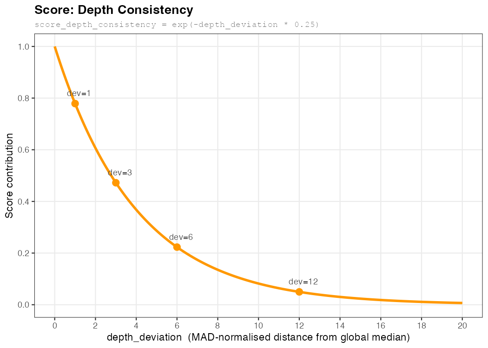
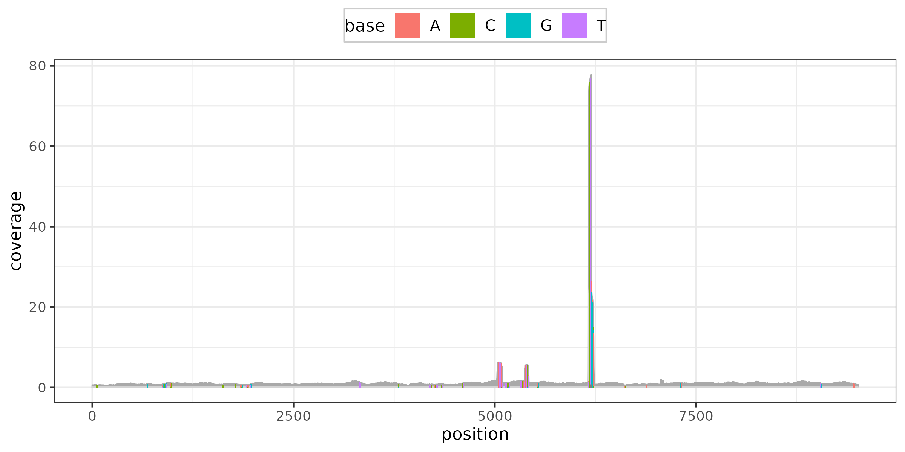
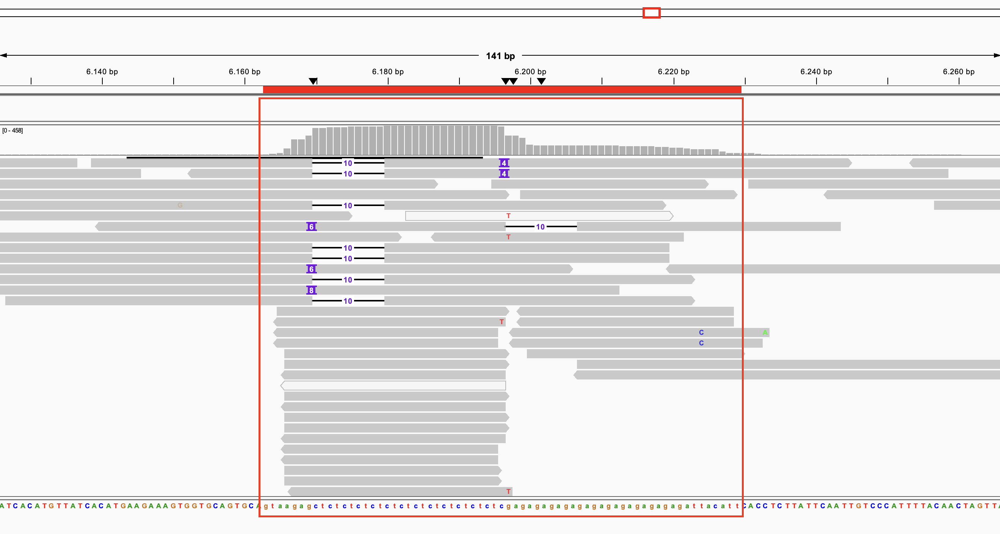

# Single_Copy_Gene_Selector
This repository contains a Snakemake pipeline which can be used to determine the best SCGs for aDNA downstream analysis.

# Setup Instructions

Before running the pipeline, ensure you have an environment with Snakemake and the required dependencies installed. For more information, see the [Pipeline Setup Guide](config/README.md).

## SCG Selection with Mixed Modern and Ancient Reads

### The Core Problem

Single-copy genes (SCGs) can be used as calibrators for read coverage normalization. The naïve approach — just taking whatever BUSCO calls "Complete" — turns out to be insufficient when you're working with ancient samples. Here's why, and what this pipeline does instead.

### Step 1: Identify Candidate SCGs via BUSCO (from Modern Reference)

The pipeline starts with BUSCO run against a **modern reference genome**. BUSCO identifies genes that are "Complete" and single-copy within the lineage's ortholog database (e.g., `drosophilidae_odb12`). From these, the pipeline extracts the actual nucleotide sequences of each SCG using the genomic coordinates in BUSCO's `full_table.tsv`, filtering out any that are too short (default: ≥2,000 bp). These sequences form the **SCG library** — essentially a custom miniature reference of candidate single-copy loci.

This step is necessary but not sufficient. BUSCO tells you that a gene appears single-copy in a high-quality modern genome assembly, but it says nothing about how well that gene will actually behave when you map real, degraded, ancient reads onto it.

### Step 2: Map All Samples (Modern + Ancient) to the SCG Library

Every sample — both modern reference-quality samples and ancient degraded samples — is independently mapped to this SCG library. For each sample, the pipeline computes the following statistics per SCG using `pysam`'s `count_coverage()`:

- **Min depth** — the minimum read depth at any position in the gene
- **Average depth** — mean read depth across all positions
- **Median depth** — median read depth across all positions
- **Max depth** — the peak pile-up at any single position
- **Covered bases** — the absolute number of positions with depth > 0
- **Breadth of coverage** — the proportion of the gene's length covered by at least one read (`covered_bases / length`)

I use `count_coverage()` instead of `samtools depth` as it is much faster. The difference is, that `count_coverage()` counts per-base observations (A/C/G/T) rather than spanning reads, so reads with deletions at a given position contribute 0 depth there. E.g. 5 reads overlapping with a deletion of one nucleotide in one read will still be counted as 5x depth in `samtools depth` but 4x in `count_coverage()` for this position. This difference is negligible for typical coverage estimation.

These stats are stored per-sample as JSON files, giving an idea of how each SCG actually behaves across the diversity of the dataset.

### Step 3: Score and Rank SCGs Across All Samples

The `determine_scg_ranking.py` script aggregates stats across all BAM files and scores each SCG on three jointly penalized criteria.

**Breadth of coverage** (`score_breadth`) is the mean breadth across all samples. A gene that isn't reliably covered across the length of its sequence is useless for normalization, even if it's deeply covered in patches.


**Depth variation** (`score_depth_variation`) is penalized exponentially using the ratio of `max_depth / mean_median_depth` (the maximum depth across all samples divided by the mean of per-sample median depths). This is computed as:

```
score_depth_variation = exp(-max_variation × 0.15)
```
Please note that the `0.15` can be adjusted but this has proven to work well in practice. Higher values will penalize more strongly.


A true single-copy gene should have relatively uniform depth. Genes with extreme local pile-ups — caused by repetitive elements (such as microsatellites in introns), alignment artifacts, or paralogs missed by BUSCO — are downranked harshly.

**Depth consistency** (`score_depth_consistency`) penalizes SCGs whose depth deviates from the global median. A MAD-based (Median Absolute Deviation) deviation score is computed across all SCGs:

```
depth_deviation = |median_depth_scg - global_median_depth_scg| / (global_MAD + ε)
score_depth_consistency = exp(-depth_deviation * 0,25)
```

`global_median_depth` is the median of all per-SCG median depths. Using the median rather than the mean makes this robust to the outliers you're trying to detect — a handful of badly-behaved SCGs won't drag the reference point.

`global_MAD` (Median Absolute Deviation) plays the role of a standard deviation but is likewise outlier-resistant. It tells you how spread out the typical SCG depths are. Dividing by it puts the deviation on a standardised scale: a depth_deviation of 1 means the SCG is one MAD away from the centre, 3 means three MADs away, and so on.

`depth_deviation` is therefore a robust z-score — how far this particular SCG sits from the centre of the depth distribution, in units of typical spread. An SCG with depth_deviation = 0 is perfectly average; one with depth_deviation = 5 is a clear outlier.

In short: SCGs that are consistently under- or over-represented relative to the bulk of SCGs are likely not truly single-copy in practice, even if BUSCO said they were. The more consistently represented they are, the more likely they are to represent a true single-copy gene.

Note: that ε is a small number to avoid division by zero.
Note: `0.25` can be adjusted but this has proven to work well in practice. Higher values will penalize more strongly.



**Final Score**

The final score is:

```
score = score_breadth + score_depth_variation + score_depth_consistency
```

score_breath and score_depth_variation are judging the individual SCG
score_depth_consistency is evaluating across all SCG

SCGs are then ranked by this score in descending order and written to both a TSV and a detailed JSON summary.

### Why This Is Better Than Either Alternative Alone

**vs. BUSCO only:** BUSCO operates on a polished modern assembly under ideal conditions. A gene "Complete" in BUSCO may perform terribly as a coverage calibrator in practice — for example, genes harbouring microsatellite tracts can produce severe localised pile-ups that inflate depth metrics and distort any normalization that relies on them. Especially working with ancient DNA (very short reads), this can be a major problem.

Example of microsatelite in a busco gene from Canis lupus:


*Example of microsatelite plotted with teplotter*



*Example of microsatelite in IGV*


**vs. Modern DNA only:** A gene that looks clean with modern Illumina reads may behave very differently when you're aligning 40 bp ancient reads. Paralogous regions that modern reads span uniquely (with longer reads or paired-end information) may cause multi-mapping problems with short ancient reads. Using only modern samples to select SCGs creates a systematic bias where the selected genes are optimized for the wrong data type.

**The mixed approach** forces every SCG to earn its place by performing consistently across both data types simultaneously. A gene that scores well across modern and ancient samples is one that can be reliably used for read coverage normalization. This makes the final SCG set much more robust as a reference for any depth-based inference in the aDNA study.